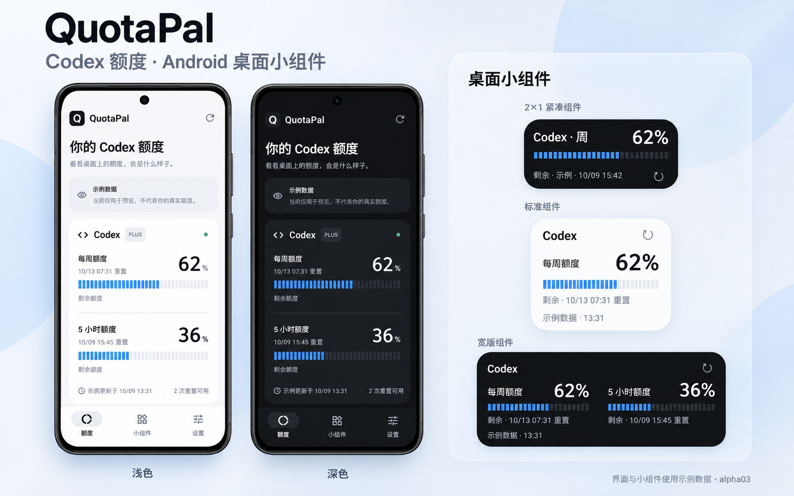

# QuotaPal

面向 Android 的 Codex 额度监控 App，参考 Nowdex 的额度速览与桌面小组件体验。首版支持单 Codex 账号，先自用验证，再公开发布。

基于原生界面截图合成的展示效果图，额度均为示例数据。[查看原生截图](docs/SCREENSHOTS.md)。

当前开发分支版本：`0.1.0-alpha08`（尚未合并）。已加入分品牌后台引导、小组件即时手动刷新与离线隐私说明。alpha06 的 45 项单元测试、lint、构建和 API 29／31／35／36 设备矩阵全部通过；alpha07 四版本 CI 全部通过；alpha08 本地 47 项单元测试通过，并补充刷新进度显示；Android 17 本地完整 15 项设备测试单轮通过，37.2／16 KB CI 待运行。已有小米 Android 17 真机连接成功反馈，真实续期、清理后更新及长期自用仍待验收。

- [开发计划](docs/DEVELOPMENT_PLAN.md)
- [开发与验收 checklist](docs/DEVELOPMENT_CHECKLIST.md)
- [GitHub milestones](https://github.com/tsonglew/QuotaPal/milestones)
- [实时开发进度](docs/PROGRESS.md)
- [CI/CD、预览 Deployments 与签名发布](docs/CI_CD.md)
- [隐私说明与数据流](docs/PRIVACY.md)
- [后台更新引导](docs/BACKGROUND_GUIDE.md)
- [小组件刷新修复验证](docs/VALIDATION_ALPHA06.md)
- [Codex 接入证据与边界](docs/CODEX_INTEGRATION.md)
- [界面规格](docs/UI_SPEC.md)
- [测试与自用验收](docs/TESTING.md)
- [历史修复 PR](https://github.com/tsonglew/QuotaPal/pull/8)
- [alpha03 验证记录与 2×1 安装包](docs/VALIDATION_ALPHA03.md)
- [alpha02 验证记录](docs/VALIDATION_ALPHA02.md)
- [首版验证与 APK 校验和](docs/VALIDATION.md)
- [原生页面和组件截图](docs/SCREENSHOTS.md)

Android 10+，Kotlin 2.1.21、Compose、Glance、Room、DataStore 和 WorkManager。固定构建链为 AGP 8.10.1、Gradle 8.11.1、JDK 17，compileSdk／targetSdk 36。

已有 Android SDK 与 JDK 17 时执行 `./gradlew testDebugUnitTest lintDebug assembleDebug`。APK 位于 `app/build/outputs/apk/debug/app-debug.apk`。有设备或模拟器时执行 `./gradlew connectedDebugAndroidTest`。GitHub Actions 会保存 APK、测试报告及原生截图。

设备登录由用户在 OpenAI 页面完成，QuotaPal 不收集密码。示例模式须主动选择并明确标注，不执行额度请求。凭据通过 Android Keystore 加密保存在本机；退出清理本机连接，远程授权不会因此自动撤销。
