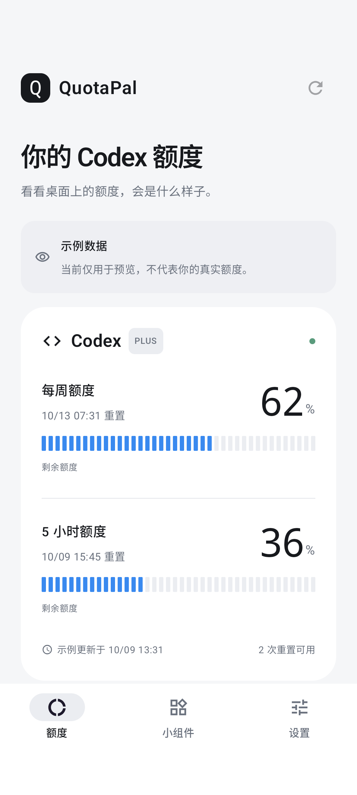
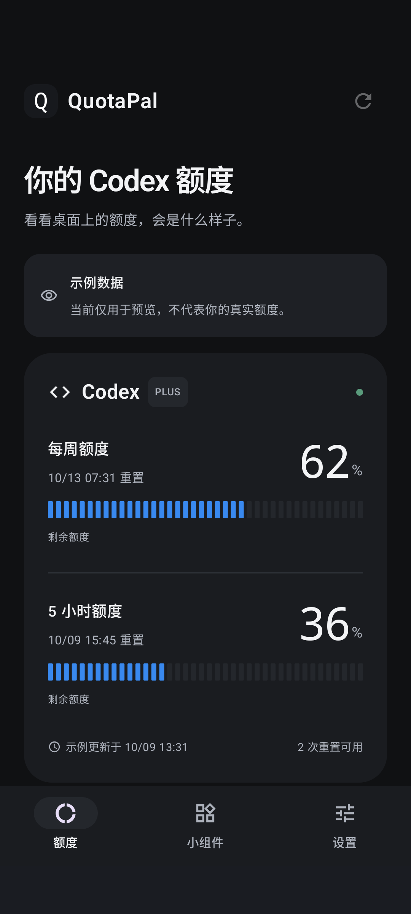
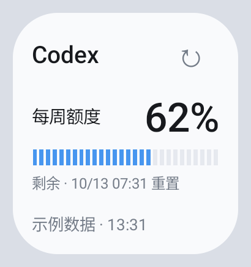
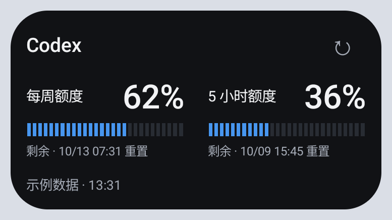
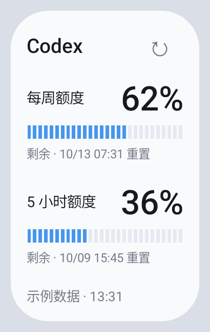
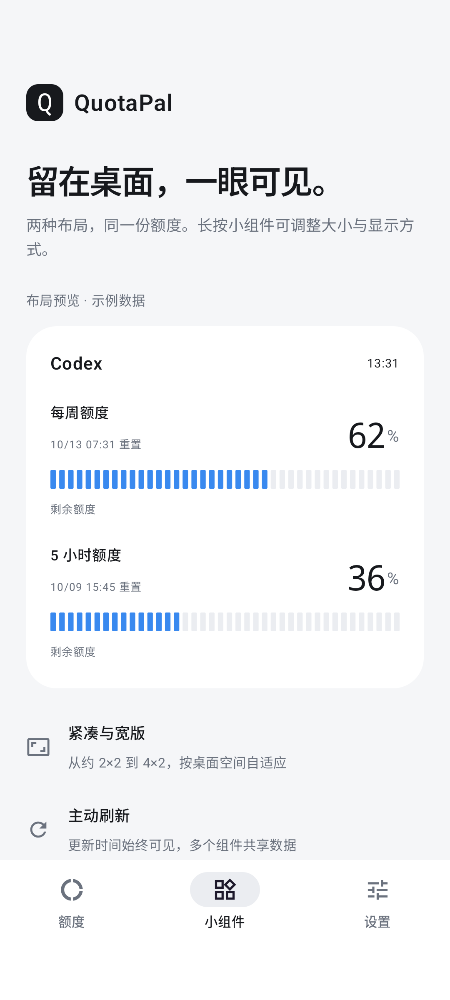
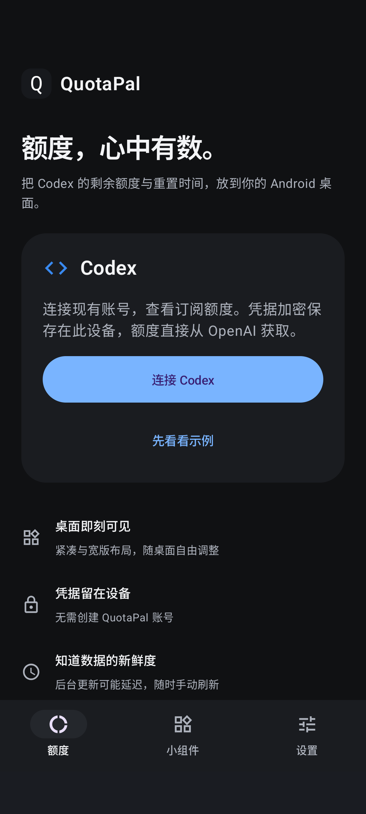

# Android 原生截图

来自 [已通过的 Android 35 设备测试](https://github.com/tsonglew/QuotaPal/actions/runs/37936883382)，并经视觉检查。所有额度均为示例数据。App 由 Compose 测试捕获，组件由真实 AppWidgetHost 渲染后使用 PixelCopy 捕获。

## 额度页

| 浅色 | 深色 |
| --- | --- |
|  |  |

## 桌面小组件

140×150 dp 紧凑版：

280×150 dp 宽版：

140×230 dp 纵向版：

## 引导与退出

| 小组件引导 | 退出后的未连接页 |
| --- | --- |
|  |  |
