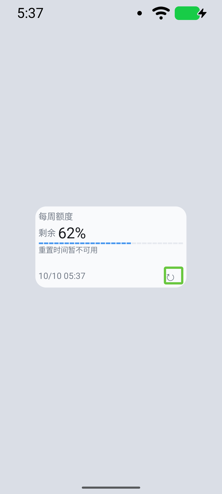

# alpha11 验证记录

2026-10-10，versionCode 11。真机环境仍为用户报告的小米 17 Ultra／Android 17，真实账号已连接；新版刷新与 OEM 后台设置效果仍待用户实际验收。

- API 29 本地复现 200% 字体、130×50dp 组件成功时间从 43px 裁至 22px。实际 View 树显示固定宽度刷新控件及间隔在旧系统生成空 TextView，默认字体使顶行高度达到 100px。刷新改水平内边距，并移除该行固定宽度间隔；原六种尺寸、完整时间／刷新可见和裁切断言未放宽，定向回归通过（26.990 秒）。完整套件进行中。
- API 37 实际 TalkBack 服务绑定、触摸探索、焦点及双击刷新验证已通过（18.348 秒）：标准与紧凑 provider 均从 62% 更新为 83%，每次只触发一个请求。截图已检查，服务及字体设置已恢复；不声称验证了实际语音音频。
- CI 37994070738 已全部结束：交付／构建及 API 31／35／36 通过；29 暴露上述裁切；37.0 SDK 下载 ZIP 损坏，37.2 在 ddmlib split install-write 阶段失败，均未执行 App 测试。37.2 数据分区 3.8GB、剩余 3.0GB，不能归因为存储不足。
- Android 17 CI 增加 SDK 安装最多三次尝试；改为 native adb 安装后执行同一个完整 instrumentation 套件，仍运行生命周期与产物检查。保存原始报告，严格检查失败状态、完成码与至少 18 项实际通过，条件跳过不计为通过。故障报告校验与交付脚本测试 19 项通过；ShellCheck／actionlint 通过。云端结果待新矩阵验证。

最终本地 API 29 完整 native 套件通过（142.986 秒）：18 项实际成功，生命周期／TalkBack 两个显式探针条件跳过；报告校验确实识别了 18 项，未把 runner 的 `OK (20 tests)` 全算为成功。47 项 JVM 测试、lint 与构建通过。APK SHA-256：`22918ec7dffed0c86cafd7d132395b7798d7377d328ed94d36121f5cf2ae279b`。

API 29 外部强停两阶段另行通过（seed 0.323 秒、restore 4.995 秒），验证原成功缓存／时间、组件实例设置和唯一周期任务恢复且不重新取额度。

